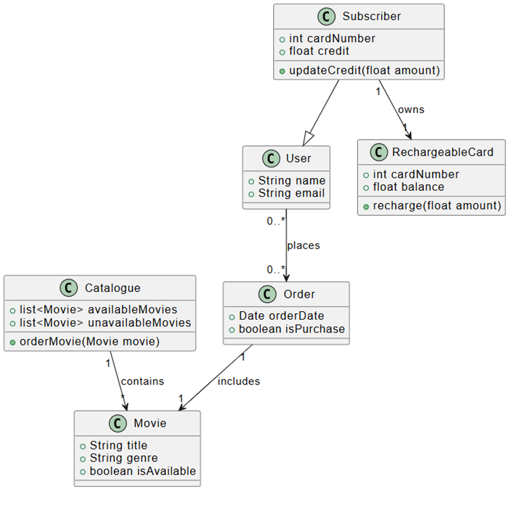
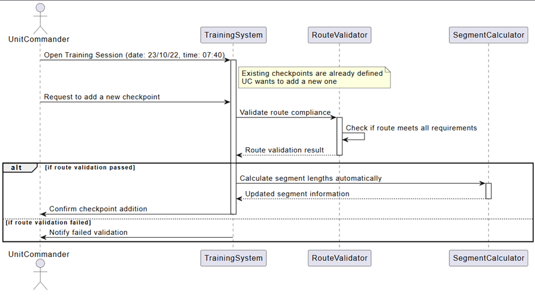
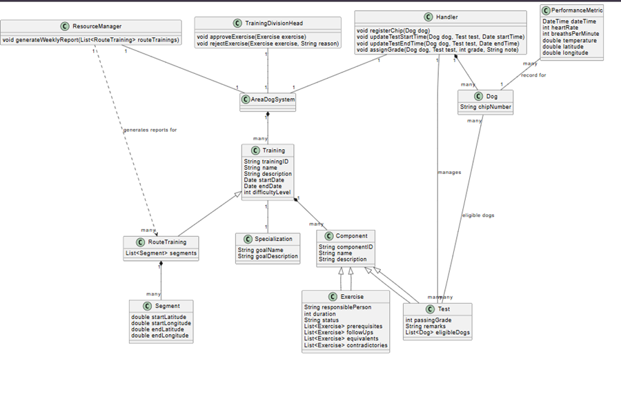
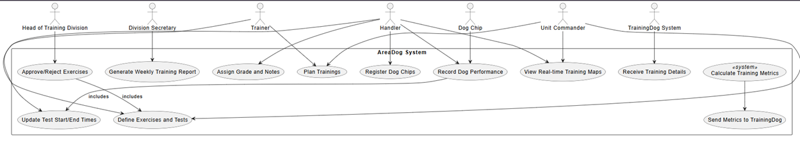

# Class Diagram – Movie Shop

## Input
- Design a system for a **movie shop**, in order to handle ordering of movies and browsing of the catalogue.  
- Support **user subscriptions** with rechargeable cards.  
- Only **subscribers** are allowed to rent movies using their card.  
- **Credit is updated** on the card during rental operations.  
- Both **users and subscribers** can buy a movie, and their data is stored in the related order.  
- When a **movie is not available**, it is ordered automatically.  

## Output

# Sequence Diagram – TrainingDog System

## Input
The **TrainingDog system** focuses on managing and tracking the dogs in the unit.  
The unit has decided on a slight change to the statuses of dogs stored in the system.  

### Intake Process
- When a new dog arrives at the unit, it goes through an **intake process**:  
  - Register details (name, date of birth).  
  - Install an identification chip.  
  - Undergo two types of checks: **medical** and **administrative**.  

### Medical Checks
- Initial check by a junior veterinarian.  
- If passed → additional check by a senior veterinarian.  
- If failed → rest + another initial check after 7 days.  
- Up to four attempts. After the fourth failure → senior veterinarian makes the final decision.  

### Administrative Checks
- Conducted by the unit secretary.  
- Includes family history and past biting incidents.  
- If unsuitable (medical or administrative) → dog is removed from the unit.  

### Assignment & Training
- Once checks are completed → dog is **assigned to a handler**.  
- Dog may be resting (waiting for training) or actively training.  

### Injuries & Recovery
- If a fit dog is injured → sent for recovery.  
- If injury occurred in training and ≤ 2 days have passed → resume same training.  
- Otherwise → wait for a new training session.  
- If recovery > 6 months → dog is removed from the unit.  

### End of Service
- Every dog completes service after **4 years**.  

### Scenario for the Diagram
Make a **Sequence Diagram** for adding a **checkpoint** to an existing **route training**.  
- Assume all screens are already open.  
- A unit commander is searching for a training session starting on **23/10/22 at 07:40**.  
- The training already has checkpoints defined, and the commander wishes to add another one.  
- It is necessary to verify **compliance with valid route definition requirements** and perform the **automatic calculation of segment lengths**.  

## Output

# Use Case / Class Diagram – AreaDog System

## Input
The **AreaDog System** manages the operational activity of dogs in the field.  

- After defining a training session, training details (ID, name, description, start date, end date, difficulty level 1–7) and specialization details (goal name, description) are received in **XML** format from the TrainingDog system.  
- For route trainings, route information is transferred (an ordered collection of segments with latitude/longitude start and end points).  

### Weekly Training Planning
- Unit commanders plan trainings for the upcoming week.  
- Each training is made of **components**: exercises and/or tests.  
- For exercises, the system stores: ID, name, description, responsible person, duration, and status.  
- Exercises may have relationships: prerequisite, follow-up, equivalent, or contradictory.  
- Tests have: ID, name, description, passing grade, and remarks.  
- A component can be both an **exercise** and a **test**.  

### Approval Process
- Exercises are submitted for approval to the Head of Training Division.  
- The division secretary generates a weekly report of route trainings with ≥3 exercises.  
- Report displays training details and exercise relationships.  
- Report is grouped by specialization and sorted by start date.  
- The Head of Division can approve/reject exercises.  
- Rejections must include reasons, and notifications are sent to the responsible person.  

### Smart Chip Integration
- Handlers register smart chips attached to dogs.  
- Chips include: GPS, heart rate, respiration, and temperature sensors.  
- Dogs can participate in approved exercises/tests.  
- Only the **most recent test record** is stored.  

### Test Execution
- At test start → handler records start time → triggers chip data transmission.  
- Chip sends **real-time performance metrics**: heart rate, respiration, temperature, location.  
- GPS data links dogs to training segments (if route training).  
- At test end → handler records end time → stops transmission → can assign grade + notes.  
- If grade < passing → handler notified that the test must be repeated.  

### Monitoring & Reports
- Handlers and commanders can view **real-time route training maps** with dog performance data.  
- After training ends:  
  - System calculates actual earliest start & latest end across all tests.  
  - For route trainings, it calculates **average metrics** (heart rate, respiration, temperature) per segment.  
  - Averages are sent to TrainingDog system in JSON format (not stored locally).  

## Output
### Class Diagram

---

### Additional Input for Use Case
" There was a **use case without an actor**, which is incorrect.  
Ensure **all actors are outside the system box**.  "

### Use Case Output

